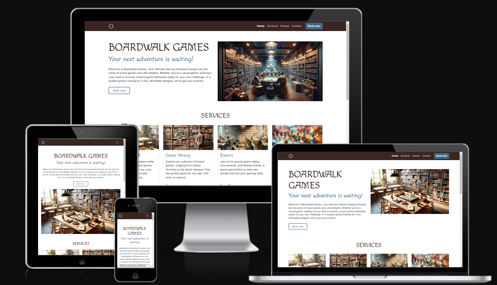

___
[pic](assets/css/images/new-games-3.webp)
[pic](/workspace/boardwalk-games/assets/css/images/services-1.webp)
[oic](
)

[bootstap](https://getbootstrap.com/)
- This is a bullet point using `-`
* This is a bullet point using `*`
+ This is a bullet point using `+`
<ul>
  <li style="list-style-type: circle; color: white; border: 1px solid black; padding-left: 0.5em;">Outlined bullet point</li>
</ul>
[frame](https://ui.dev/amiresponsive?url=https://richard-l4.github.io/boardwalk-games/)

[bootstap](https://getbootstrap.com/)
[frame](https://ui.dev/amiresponsive?url=https://richard-l4.github.io/boardwalk-games/)

![pics] (/workspace/boardwalk-games/assets/css/images/Screenshot 2024-11-08 194747.png)

